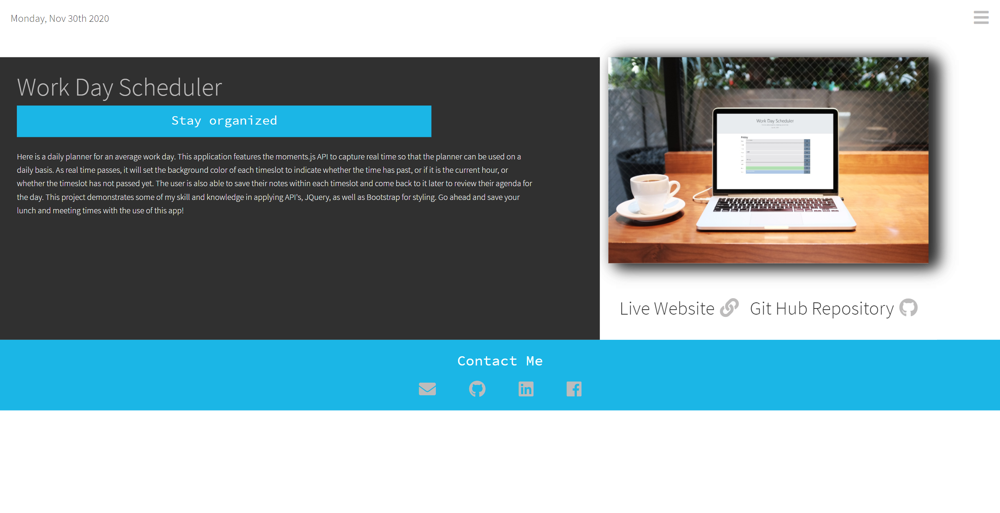

# Portfolio_2.0
# Description
Here is my personal portfolio 2.0! This portfolio is a polished and modernized version of my original portfolio as it features my improved skillset in HTML, CSS, as well as JavaScript for animations. I have also applied the moments.js API to give the current date in the top left corner. Within my portfolio are links to some of my other works, as well as, links to my resume and contact information.

## Table of Contents

* [License](#license)
* [Contributing](#contributing)
* [Screenshot](#screenshot)
* [Link](#link)
* [Questions](#questions)

## License

MIT

## Contributing

Ianaac27

# Screenshot
Here are mocks of Portfolio 2.0.

Home Page

Navigation Menu

Project Page

# Link
Take a look at the live version [here.](https://ianaac27.github.io/Portfolio_2.0/index.html)

## Questions

If you have any questions, please refer to my contact information below.

[GitHub: Ianaac27](https://www.github.com/Ianaac27)

Email: ian.fleshmancooper@gmail.com

