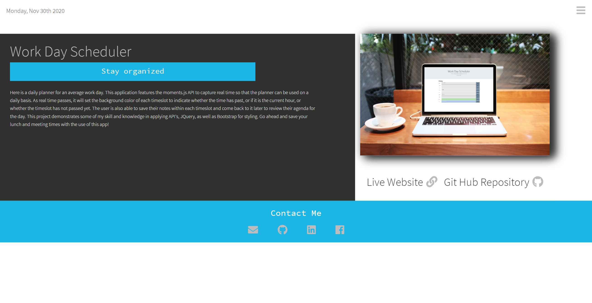

# Portfolio_2.0
# Description
Here is my personal portfolio 2.0! This portfolio is a polished and modernized version of my original portfolio as it features my improved skillset in HTML, CSS, as well as JavaScript for animations. I have also applied the moments.js API to give the current date in the top left corner. Within my portfolio are links to some of my other works, as well as, links to my resume and contact information.

# Screenshot
Here are mocks of Portfolio 2.0.

# Link
Take a look at the live version [here.](https://ianaac27.github.io/Portfolio_2.0/index.html)
